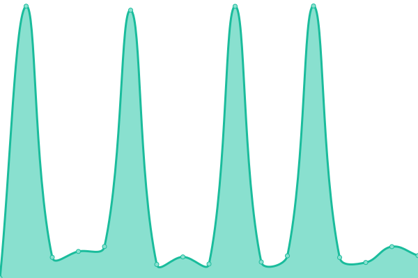

# [📈 Live Status](https://fitzwilliammuseum.github.io/uptime): <!--live status--> **🟩 All systems operational**

This repository contains the open-source uptime monitor and status page for [The Fitzwilliam Museum](https://fitzmuseum.cam.ac.uk), powered by [Upptime](https://github.com/upptime/upptime).

With [Upptime](https://upptime.js.org), you can get your own unlimited and free uptime monitor and status page, powered entirely by a GitHub repository. We use [Issues](https://github.com/fitzwilliammuseum/uptime/issues) as incident reports, [Actions](https://github.com/fitzwilliammuseum/uptime/actions) as uptime monitors, and [Pages](https://fitzwilliammuseum.github.io/uptime) for the status page.

<!--start: status pages-->
<!-- This summary is generated by Upptime (https://github.com/upptime/upptime) -->
<!-- Do not edit this manually, your changes will be overwritten -->
<!-- prettier-ignore -->
| URL | Status | History | Response Time | Uptime |
| --- | ------ | ------- | ------------- | ------ |
|  [Main website](https://fitzmuseum.cam.ac.uk) | 🟩 Up | [main-website.yml](https://github.com/FitzwilliamMuseum/uptime/commits/HEAD/history/main-website.yml) | 

 1003ms
     
 | 

<a href="https://uptime.fitz.ms/history/main-website">100.00%</a>
    

|  [Collection](https://data.fitzmuseum.cam.ac.uk) | 🟩 Up | [collection.yml](https://github.com/FitzwilliamMuseum/uptime/commits/HEAD/history/collection.yml) | 

 1281ms
     
 | 

<a href="https://uptime.fitz.ms/history/collection">100.00%</a>
    

|  [Human Touch](https://human-touch.beta.fitz.ms) | 🟩 Up | [human-touch.yml](https://github.com/FitzwilliamMuseum/uptime/commits/HEAD/history/human-touch.yml) | 

 523ms
     
 | 

<a href="https://uptime.fitz.ms/history/human-touch">100.00%</a>
    

|  [Coffins](http://egyptiancoffins.org) | 🟩 Up | [coffins.yml](https://github.com/FitzwilliamMuseum/uptime/commits/HEAD/history/coffins.yml) | 

 323ms
     
 | 

<a href="https://uptime.fitz.ms/history/coffins">100.00%</a>
    

|  [Winsor and Newton](https://winsorandnewton.fitzmuseum.cam.ac.uk/) | 🟩 Up | [winsor-and-newton.yml](https://github.com/FitzwilliamMuseum/uptime/commits/HEAD/history/winsor-and-newton.yml) | 

 688ms
     
 | 

<a href="https://uptime.fitz.ms/history/winsor-and-newton">100.00%</a>
    

|  [Beyond the Label](https://beyondthelabel.fitzmuseum.cam.ac.uk/) | 🟩 Up | [beyond-the-label.yml](https://github.com/FitzwilliamMuseum/uptime/commits/HEAD/history/beyond-the-label.yml) | 

 175ms
     
 | 

<a href="https://uptime.fitz.ms/history/beyond-the-label">100.00%</a>
    

|  [Creative Economy](https://creative-economy.fitzmuseum.cam.ac.uk/) | 🟩 Up | [creative-economy.yml](https://github.com/FitzwilliamMuseum/uptime/commits/HEAD/history/creative-economy.yml) | 

 185ms
     
 | 

<a href="https://uptime.fitz.ms/history/creative-economy">100.00%</a>
    

|  [Do Not Touch](https://do-not-touch.fitzmuseum.cam.ac.uk) | 🟩 Up | [do-not-touch.yml](https://github.com/FitzwilliamMuseum/uptime/commits/HEAD/history/do-not-touch.yml) | 

 288ms
     
 | 

<a href="https://uptime.fitz.ms/history/do-not-touch">100.00%</a>
    

|  [Feast and Fast](https://feast-and-fast.fitzmuseum.cam.ac.uk) | 🟩 Up | [feast-and-fast.yml](https://github.com/FitzwilliamMuseum/uptime/commits/HEAD/history/feast-and-fast.yml) | 

 197ms
     
 | 

<a href="https://uptime.fitz.ms/history/feast-and-fast">100.00%</a>
    

|  [Tickets](https://tickets.museums.cam.ac.uk) | 🟩 Up | [tickets.yml](https://github.com/FitzwilliamMuseum/uptime/commits/HEAD/history/tickets.yml) | 

 3058ms
     
 | 

<a href="https://uptime.fitz.ms/history/tickets">100.00%</a>
    

|  [UCM](https://museums.cam.ac.uk) | 🟩 Up | [ucm.yml](https://github.com/FitzwilliamMuseum/uptime/commits/HEAD/history/ucm.yml) | 

 795ms
     
 | 

<a href="https://uptime.fitz.ms/history/ucm">100.00%</a>
    

|  [Schools project](http://schools.fitzmuseum.cam.ac.uk) | 🟩 Up | [schools-project.yml](https://github.com/FitzwilliamMuseum/uptime/commits/HEAD/history/schools-project.yml) | 

 1085ms
     
 | 

<a href="https://uptime.fitz.ms/history/schools-project">100.00%</a>
    

|  [Content API](https://content.fitz.ms) | 🟩 Up | [content-api.yml](https://github.com/FitzwilliamMuseum/uptime/commits/HEAD/history/content-api.yml) | 

 1073ms
     
 | 

<a href="https://uptime.fitz.ms/history/content-api">100.00%</a>
    

|  [Public CIIM](https://api.fitz.ms) | 🟩 Up | [public-ciim.yml](https://github.com/FitzwilliamMuseum/uptime/commits/HEAD/history/public-ciim.yml) | 

 883ms
     
 | 

<a href="https://uptime.fitz.ms/history/public-ciim">100.00%</a>
    

|  [Micropasts](https://crowdsourced.micropasts.org) | 🟩 Up | [micropasts.yml](https://github.com/FitzwilliamMuseum/uptime/commits/HEAD/history/micropasts.yml) | 

 1179ms
     
 | 

<a href="https://uptime.fitz.ms/history/micropasts">100.00%</a>
    

|  [Kunisada](https://kunisada-and-kabuki.fitzmuseum.cam.ac.uk) | 🟩 Up | [kunisada.yml](https://github.com/FitzwilliamMuseum/uptime/commits/HEAD/history/kunisada.yml) | 

 168ms
     
 | 

<a href="https://uptime.fitz.ms/history/kunisada">100.00%</a>
    

|  [Intranet](https://intranet.fitzmuseum.cam.ac.uk) | 🟩 Up | [intranet.yml](https://github.com/FitzwilliamMuseum/uptime/commits/HEAD/history/intranet.yml) | 

 927ms
     
 | 

<a href="https://uptime.fitz.ms/history/intranet">100.00%</a>
    

|  [Mapping Antiquity](https://mapping-antiquity.fitzmuseum.cam.ac.uk) | 🟩 Up | [mapping-antiquity.yml](https://github.com/FitzwilliamMuseum/uptime/commits/HEAD/history/mapping-antiquity.yml) | 

 185ms
     
 | 

<a href="https://uptime.fitz.ms/history/mapping-antiquity">100.00%</a>
    

|  [Portrait Miniatures](https://unlocking-miniatures.fitzmuseum.cam.ac.uk) | 🟩 Up | [portrait-miniatures.yml](https://github.com/FitzwilliamMuseum/uptime/commits/HEAD/history/portrait-miniatures.yml) | 

 185ms
     
 | 

<a href="https://uptime.fitz.ms/history/portrait-miniatures">100.00%</a>
    

|  [A museum of relationships](https://amor.fitz.ms) | 🟩 Up | [a-museum-of-relationships.yml](https://github.com/FitzwilliamMuseum/uptime/commits/HEAD/history/a-museum-of-relationships.yml) | 

 755ms
     
 | 

<a href="https://uptime.fitz.ms/history/a-museum-of-relationships">100.00%</a>
    

|  [URL shortener](https://fitz.ms) | 🟩 Up | [url-shortener.yml](https://github.com/FitzwilliamMuseum/uptime/commits/HEAD/history/url-shortener.yml) | 

 953ms
     
 | 

<a href="https://uptime.fitz.ms/history/url-shortener">100.00%</a>
    

|  [Data Islands](https://data-islands.fitzmuseum.cam.ac.uk) | 🟩 Up | [data-islands.yml](https://github.com/FitzwilliamMuseum/uptime/commits/HEAD/history/data-islands.yml) | 

 193ms
     
 | 

<a href="https://uptime.fitz.ms/history/data-islands">100.00%</a>
    

|  [Being an Islander](https://islander.fitzmuseum.cam.ac.uk) | 🟩 Up | [being-an-islander.yml](https://github.com/FitzwilliamMuseum/uptime/commits/HEAD/history/being-an-islander.yml) | 

 155ms
     
 | 

<a href="https://uptime.fitz.ms/history/being-an-islander">100.00%</a>
    

<!--end: status pages-->

[**Visit our status website →**](https://fitzwilliammuseum.github.io/uptime)

## 📄 License

- Powered by: [Upptime](https://github.com/upptime/upptime)
- Code: [MIT](./LICENSE) © [The Fitzwilliam Museum](https://fitzmuseum.cam.ac.uk)
- Data in the `./history` directory: [Open Database License](https://opendatacommons.org/licenses/odbl/1-0/)
